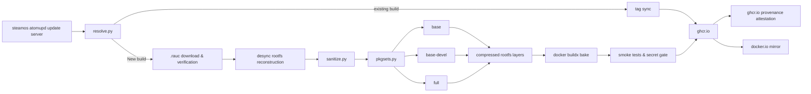

# SteamOS Deckard Docker Images
Unofficial SteamOS(holo) Steam Frame ARM64 Docker image

Automatically fetch update branches from atomupd server for every hour, build Docker images, and publish to [GitHub Container Registry](https://docs.github.com/en/packages/working-with-a-github-packages-registry/working-with-the-container-registry).

> [!NOTE]
> Used AI(Claude Sonnet 5.5) to make of this project, but I tried to make less shit :-) 

> [!IMPORTANT]
> For security reasons, these images strip the pacman lsign key.\
> This is because the same key would be spread to all containers of the same image, allowing for malicious actors to inject packages (via, for example, a man-in-the-middle).\
> In order to create a lsign-key run `pacman-key --init` on the first execution, but be careful to not redistribute that key.


## Tags
`latest` is `base-stable`

- `base`
- `base-devel`
- `full` - untouched, included all
- `{variant}-{buildid}` - pinned version, ex) `base-20260922.6101926`

You can also use branch tags like `base-devel-beta`, `base-main`, etc.


## Usage
```bash
docker run -it --rm ghcr.io/aeongdesu/holo-deckard:latest
```

also supports [`docker.io/aeongdesu/holo-deckard`](https://hub.docker.com/r/aeongdesu/holo-deckard) as alternative


## Flowchart


---

This repository is derived from [archlinux/archlinux-docker](https://gitlab.archlinux.org/archlinux/archlinux-docker)
